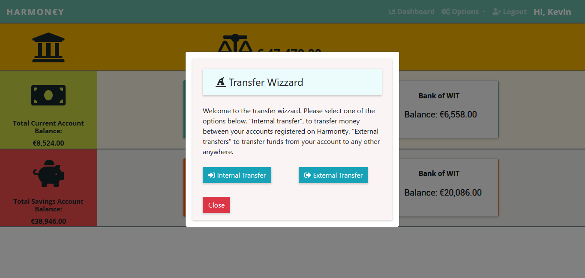

# Harmon€y 
### A Financial Accounts Management System

 
### By Kevin O'Keeffe 
This is a Final Year Project.
BSc(Hons) in Software Systems Development,
Department of Computing and Mathematics, 
School of Science and Computing, WIT

[Demo Video Link]()

WebSite page: [Harmon€y](https://harmoney-client.web.app/#/).

Harmon€y is a proof of concept full stack application which elables users to 
control all their fancial accounts from a single application. Thus, giving 
users the ability to budget, manage and track their finances at ease.
The project is only made possible by the Payment Services  Directive (PSD2)
and Open Banking.

Harmon€y is built using the MEVN stack. MongoDB, Express.js, Vue,js and Node.js.

### System features include:
- User authentication and validation through the use of tokens.
- Two Factor Authentication through mobile SMS.
- Animated Background.
- Dashboard accounts overview (gathering data from mulitable financial institutions).
- Add financial institution accounts.
- Preform transactions.
- View statements.
- Remove financial institution accounts.
- Delete Harmon€y account.
- Client to Server to Server communication.
- Fully CRUD.
- Cypress testing.
- CI-CD.

## Client UI.

This is the Harmon€y home page. Your options are to Sign Up, login or view the About page. 

This is the Harmon€y sign up page. Your standard sign up form with two factor authentication integrated. 

This is the login page where the user can login with valid credentials. Mobile 2FA is in force.

This is the login validation code prompt. One must enter a valid code recived on the users registered mobile number to proceed.

This is the accounts overview dashboard. Where a user can interact with the accounts added to the Harmon€y service.

This page is where you connect your financial institution accounts to the Harmon€y service.

The account details modal.
When an account is selected in the dashboard the user is presented with this modal.

The account transactions statement modal.
A user can view this modal, by selecting the statement button in the accounts details modal. 

The transfer wizard modal.
This modal is accessed when a user enters the account details modal and selects the transfer button.

The internal transfer modal.
This is where a user can transfer money between their accounts within the harmon€y system.

The external transfer modal.
This is where a user can transfer money from one account ot any other account with a valid IBAN.

This is the remove account page where a user can remove financial institutions accounts from the system.

This is where a user can view their personal details on the Harmon€y system. A user can delete their Hharmon€y account from this page by selecting the delete button and following the steps.

This is the about page it gives a brief description of the service that Harmon€y intends to provide.